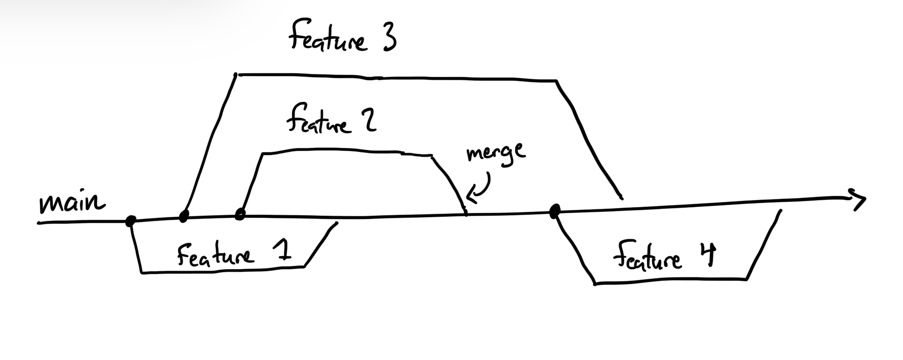

# Github Netiquette

Working with other people when publishing software requires clear collaboration and communication between everyone. In this document, you will learn how to use Git and Github and some of the best practices for those services.

## Introduction to Git

Git is not the same as Github. Git is a way to store code locally on your machine in something called a **repository**. You can think of it as a folder on your computer storing all of code needed for your project. The great thing about Git is that you have the ability to switch between different versions of your code with a simple command, called branches.

### Branching

Consider the following scenario: We have a main branch of code that we run all of our software on. In industry, that would be called "production" - its the code base that gets used in the product the user sees. If we want to develop a new feature, we would create a new branch to work on that feature. When we're done developing it, then we can merge it back into the main branch.



In most cases, you will be working in a repository that you downloaded from Github. But you can create your own repositories by using `git init` in the terminal. In the following code block there is an example of branching:

```
git init #initialize git repositiory
git branch new_feature #create a new branch
git branch #list branches
git checkout new_feature #switch to the new branch
```

### Commiting and Stashing

When you make changes to your code, git takes notice of that and wont let you change your branch until you have either **committed** or **stashed** your code. When you commit your code, a log gets written telling everyone that may be using that repository that you have made changes to your code on that branch. Think of it like a save button. When you stash your code, you're still saving it, but the changes you make get reverted back to what the files were before you changed them. You can retrieve your modified files by using `git stash apply`. But, stashing is less common than committing.

Below is an example of the commands used to commit your code to your current branch:

```
# on branch feature_1
git add <file1> <file2> <folder1> # add only a couple files to the 'staging area'
git add . # I'll instead add everything in this directory
git add -a # I'll instead add everything that's changed in the repo
git commit -m "My awesome code changes" # commit your code with a message denoting your changes
git checkout main # Now that my changes have been saved, I can safely switch branches.
```

### Merging Branches

Say you have interworking features that you have developed on different branches. `feature_1` is it's own branch and `feature_2` has its own branch. If you want to put some of the code you have on `feature_1` from `feature_2`, you will need to use `merge` to do so.

```
git checkout feature_1 # move to the feature_1 branch
git merge feature_2 # merge feature_2 into feature_1
```

You may encounter something called a **merge conflict**. When this happens, a piece of code from both of the branches is saying something different. For example, you may see the following in your code when you try to merge:

```
<<<<<< HEAD
def myFunction(var1, var2):
======
def myFunction(var1):
>>>>>> Feature_2
```

You simply need to choose which bit of code to keep, and you can delete the rest.

## Introductinon to Github

Github is similar to Git in that code is stored in a repository, but just online, called a "remote repository". You can craete and merge branches, but the code you write is still done on your computer. You likely cloned this repository on to your machine using `git clone git@github.com:CU-Robosub/softwareTutorials.git`. You can push the code you write from your machine to Github using `git push`. This will be reitterated later, but **DO NOT PUSH TO THE MAIN BRANCH**. You can use your own feature branch to commit and push code changes that will be reflected in the remote repository.

If there is a feature branch you want to merge back into the main branch, you can create something called a **Pull Request**. To do so, go to the repository's page, click "pull requests" in the top bar, and click create a pull request. You can specify the branch you want to merge your feature branch into. Additionally, you can write a message pointing out the changes you've made. The reason for doing this is to ensure the main branch's code does not get corrupted by a potentially broken feature. But, if something does happen and the main branch gets affected, don't panic. That is what `git revert` is for.

## Etiquette

Please make sure to do the following when coding and creating pull requests:

- Commit your code with a short thoughtful message
- Comment the functionality of a new piece of code you develop above your code
- Create a pull request with a message describing the feature added, and if some parts of the code are convoluted or confusing, briefly exaplin why you made those changes.
- Do NOT commit to the main branch in the Github repository.
